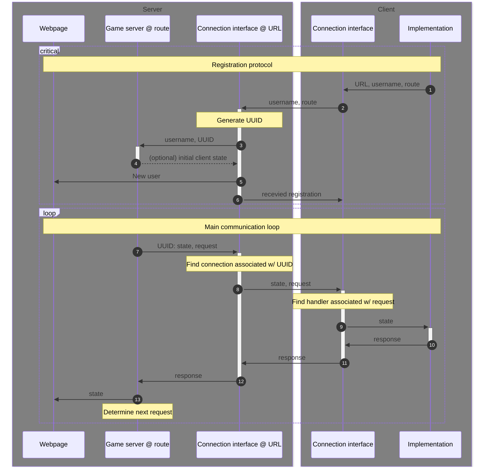

# Project specs!

Since the purpose of this project is to enable various implementations, we need to define some sort of protocol that all implementations must follow. To some extent, this entire project would then be 'an implementation' of that protocol. However, not everything in this project is a part of this specification. For example, the frontend that one can visit to see the current state is not specified anywhere.

## Structure / architecture
Now this protocol presupposes two main parts: a client and a server. Both the client and the server have a frontend and a backend and both work in completely different ways. The server is the authority, so we will define the manner in which the server works perhaps a little arbitrarily, and we expect every client to follow this. Below is a diagram of the structure and how each part corresponds to other parts.



Now lets define the format of each message sent internally and over the websocket connection:
- The registration packet (2):
```json
{
    "action": "register",
    "name": username,
    "room": route
}
```
as defined in [verify.py](/app/verify.py):
```py
class RegisterPacket(BaseMessage):
    action: str = "register"
    name: str
    room: str
```
- The registration response (6):
```json
{
	"type": "regResp",
	"msg": Any, // optional
}
```
It is conceivable that you may want to send some sort of initial state to each player and only once. For that reason, the regResp message both exists and has the optional field `'msg'` that can be filled with any message, specified by the game server. Note that any game server may have its own specification on which messages are expected and in which format.

- Main loop requests (8)
These requests are completely dependant on the specification of the game. Here is an example
```json
{
    "type": "turn",
    "state": {
        ...
    }
}
```
- Main loop request responses (11)
Once again dependant on different specifications, but here is another format example. You should be able to quickly see an overview of all accepted responses at the top of all implementations of [game.py](/game/game.py), with a neat pydantic setup.
```json
{
    "choice": move //
}
```

Note that the pair of 8 and 11 can change and do not have a set format. That depends on the game implemented. For example, the server may have a follow op request that is specific and wait for a response that suits that request. Summary: see game server specific documentation for (8) and (11)