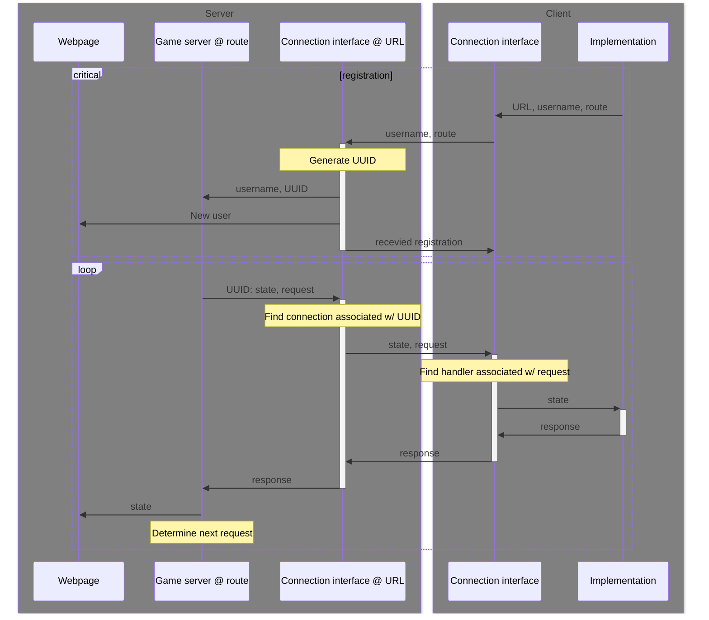

# Project specs!

Since the purpose of this project is to enable various implementations, we need to define some sort of protocol that all implementations must follow. To some extent, this entire project would then be 'an implementation' of that protocol. However, not everything in this project is a part of this specification. For example, the frontend that one can visit to see the current state is not specified anywhere.

## Structure / architecture
Now this protocol presupposes two main parts: a client and a server. Both the client and the server have a frontend and a backend and both work in completely different ways. The server is the authority, so we will define the manner in which the server works as the main 

## test
