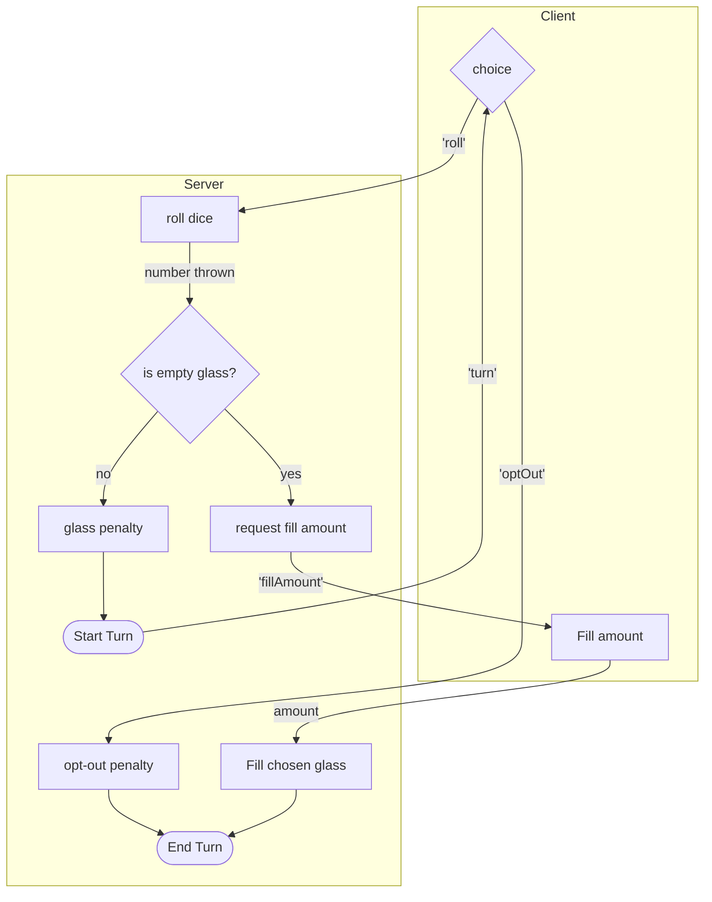

Game state flowchart

```mermaid
flowchart TD

    subgraph C[Client]
        C1{choice}
        C_FIL[Fill amount]
    end

    subgraph S[Server]
        Start([Start Turn])
        S_OPT[opt-out penalty]
        S_ROL[roll dice]
        S_ISE{is empty glass?}
        S_RFA[request fill amount]
        S_DRI[glass penalty]
        S_FIL[Fill chosen glass]
        End([End Turn])
    end

    Start -- 'turn' --> C1

    C1 -- 'optOut' --> S_OPT --> End
    C1 -- 'roll' --> S_ROL -- number thrown--> S_ISE
    
    S_ISE -- no --> S_DRI --> Start
    S_ISE -- yes --> S_RFA -- 'fillAmount' --> C_FIL -- amount --> S_FIL --> End
```